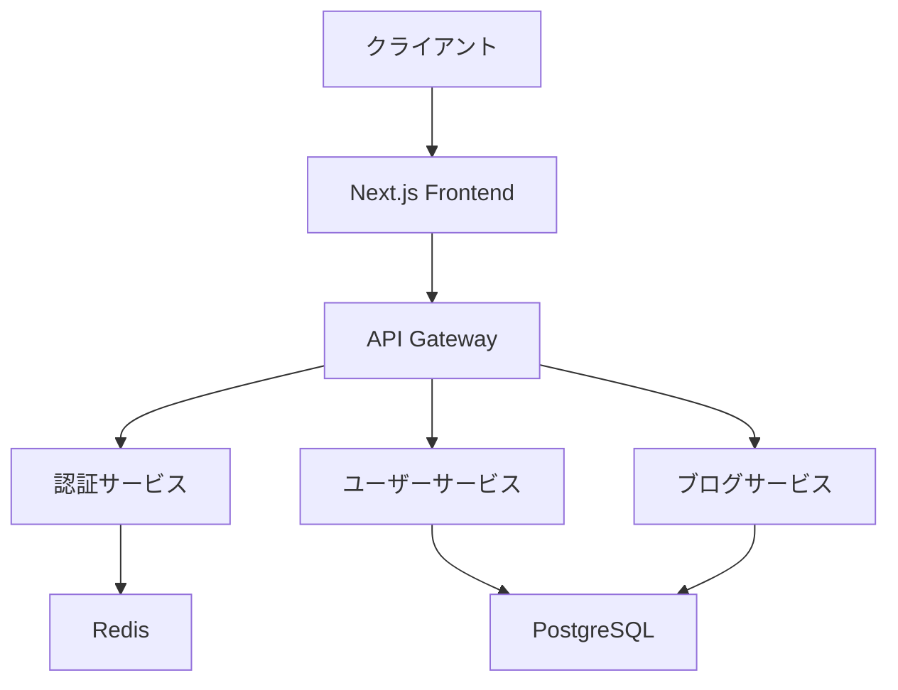

# Markdownの全機能デモンストレーション

この記事では、Markdownで利用可能な全ての記法を使用して、包括的なサンプルコンテンツを作成します。

## はじめに

> "コードは詩である。美しく、表現力豊かで、そして意味のあるものでなければならない。"
>
> — Robert C. Martin, Clean Code

現代のウェブ開発において、**適切なツールの選択**と*効率的な開発プロセス*は成功の鍵となります。

## 主要な技術スタック

### フロントエンドフレームワーク

1. **React** - UIライブラリの王様
2. **Next.js** - React用フレームワーク
3. **Vue.js** - プログレッシブフレームワーク
4. **Angular** - フルスタックフレームワーク

### スタイリングソリューション

- **Tailwind CSS** - ユーティリティファーストCSS
- **Styled Components** - CSS-in-JS
- **Emotion** - パフォーマンス重視のCSS-in-JS
- **SCSS/Sass** - CSS拡張言語

## コード例

### JavaScript/TypeScript

```javascript
// 基本的なReactコンポーネント
import React, { useState, useEffect } from 'react';

const BlogPost = ({ title, content, author }) => {
  const [isLoading, setIsLoading] = useState(false);
  const [comments, setComments] = useState([]);

  useEffect(() => {
    fetchComments();
  }, []);

  const fetchComments = async () => {
    setIsLoading(true);
    try {
      const response = await fetch(`/api/comments/${postId}`);
      const data = await response.json();
      setComments(data);
    } catch (error) {
      console.error('コメントの取得に失敗しました:', error);
    } finally {
      setIsLoading(false);
    }
  };

  return (
    <article className="max-w-4xl mx-auto px-6">
      <header>
        <h1 className="text-4xl font-bold mb-4">{title}</h1>
        <p className="text-gray-600">著者: {author}</p>
      </header>
      <main dangerouslySetInnerHTML={{ __html: content }} />
      <footer>
        {isLoading ? (
          <p>コメントを読み込み中...</p>
        ) : (
          <CommentsList comments={comments} />
        )}
      </footer>
    </article>
  );
};

export default BlogPost;
```

### TypeScript型定義

```typescript
// 型安全なAPI設計
interface User {
  id: string;
  name: string;
  email: string;
  avatar?: string;
  createdAt: Date;
  updatedAt: Date;
}

interface BlogPost {
  id: string;
  title: string;
  slug: string;
  content: string;
  excerpt: string;
  author: User;
  category: Category;
  tags: Tag[];
  publishedAt: Date | null;
  isPublished: boolean;
}

type ApiResponse<T> = {
  data: T;
  meta: {
    total: number;
    page: number;
    limit: number;
  };
  success: boolean;
  message?: string;
};

// ジェネリック関数の例
const fetchData = async <T>(
  endpoint: string,
  options?: RequestInit
): Promise<ApiResponse<T>> => {
  const response = await fetch(endpoint, options);
  if (!response.ok) {
    throw new Error(`HTTP error! status: ${response.status}`);
  }
  return response.json();
};
```

### CSS/Tailwind

```css
/* カスタムCSS */
@layer components {
  .btn-primary {
    @apply px-6 py-3 bg-blue-600 text-white font-semibold rounded-lg
           hover:bg-blue-700 focus:ring-2 focus:ring-blue-500
           focus:ring-offset-2 transition-colors duration-200;
  }

  .card {
    @apply bg-white dark:bg-gray-800 rounded-xl shadow-lg
           border border-gray-200 dark:border-gray-700
           overflow-hidden;
  }

  .gradient-text {
    @apply bg-gradient-to-r from-blue-600 to-purple-600
           bg-clip-text text-transparent;
  }
}

/* アニメーション */
@keyframes fadeInUp {
  from {
    opacity: 0;
    transform: translateY(30px);
  }
  to {
    opacity: 1;
    transform: translateY(0);
  }
}

.animate-fade-in-up {
  animation: fadeInUp 0.6s ease-out forwards;
}
```

## 表組みとデータ

### パフォーマンス比較表

| フレームワーク | バンドルサイズ | 初期読み込み時間 | ランタイム性能 | 学習コスト |
|-------------|------------|--------------|------------|----------|
| React       | 42.2KB     | 1.2s         | ⭐⭐⭐⭐⭐    | 中        |
| Vue.js      | 34.8KB     | 0.9s         | ⭐⭐⭐⭐     | 低        |
| Angular     | 130KB      | 2.1s         | ⭐⭐⭐⭐     | 高        |
| Svelte      | 10.3KB     | 0.6s         | ⭐⭐⭐⭐⭐    | 中        |

### ブラウザサポート状況

| 機能           | Chrome | Firefox | Safari | Edge | IE11 |
|---------------|--------|---------|--------|------|------|
| ES6 Modules   | ✅      | ✅       | ✅      | ✅    | ❌    |
| CSS Grid      | ✅      | ✅       | ✅      | ✅    | ❌    |
| Web Components| ✅      | ✅       | ✅      | ✅    | ❌    |
| Service Worker| ✅      | ✅       | ✅      | ✅    | ❌    |

## リストとタスク

### 開発フェーズのチェックリスト

#### 設計段階
- [x] 要件定義の完了
- [x] 技術スタックの選定
- [x] アーキテクチャ設計
- [ ] UIデザインの作成
- [ ] データベース設計

#### 開発段階
- [x] 開発環境のセットアップ
- [x] 基本的なプロジェクト構造の作成
- [ ] 認証システムの実装
- [ ] API設計と実装
- [ ] フロントエンド画面の実装

#### テスト段階
- [ ] ユニットテストの作成
- [ ] 統合テストの実装
- [ ] E2Eテストの設定
- [ ] パフォーマンステスト
- [ ] セキュリティテスト

### 推奨リソース

#### 必読書籍
1. "Clean Code" by Robert C. Martin
2. "JavaScript: The Good Parts" by Douglas Crockford
3. "You Don't Know JS" シリーズ by Kyle Simpson
4. "Effective TypeScript" by Dan Vanderkam

#### オンラインリソース
- **MDN Web Docs** - Web標準のリファレンス
- **React Documentation** - 公式ドキュメント
- **TypeScript Handbook** - 型システムの詳細
- **CSS-Tricks** - CSS技法集

## 数式とコード

### アルゴリズムの時間計算量

Big O記法を使用した計算量の表現：

- **O(1)** - 定数時間
- **O(log n)** - 対数時間
- **O(n)** - 線形時間
- **O(n log n)** - 準線形時間
- **O(n²)** - 二次時間

```python
# 二分探索アルゴリズム (O(log n))
def binary_search(arr, target):
    left, right = 0, len(arr) - 1

    while left <= right:
        mid = (left + right) // 2

        if arr[mid] == target:
            return mid
        elif arr[mid] < target:
            left = mid + 1
        else:
            right = mid - 1

    return -1

# 使用例
numbers = [1, 3, 5, 7, 9, 11, 13, 15]
result = binary_search(numbers, 7)
print(f"インデックス: {result}")  # 出力: インデックス: 3
```

## 引用とハイライト

### 業界の専門家からの引用

> "プログラミングは、問題を小さな部分に分割し、それぞれを解決する技術である。"
>
> — John Johnson, Software Engineering Lead at Google

重要な概念については、以下のように強調します：

> ⚠️ **重要**: パフォーマンス最適化は、まず測定から始めよ。推測するな、計測せよ。

> 💡 **ヒント**: TypeScriptを使用する場合、`strict`モードを有効にして型安全性を最大化しましょう。

> 📝 **メモ**: React 18の新機能であるConcurrent Featuresは、ユーザーエクスペリエンスを大幅に改善します。

## 画像とメディア

### アーキテクチャ図



## リンクと参考資料

### 外部リンク
- [React公式サイト](https://react.dev/)
- [Next.js Documentation](https://nextjs.org/docs)
- [TypeScript Handbook](https://www.typescriptlang.org/docs/)
- [Tailwind CSS](https://tailwindcss.com/)

### 内部リンク
- [前回の記事: Next.jsチュートリアル](./next-js-tutorial)
- [関連記事: 数学的概念の解説](./math-test-simple)

## まとめ

この記事では、Markdownの様々な記法を使用して包括的なコンテンツを作成しました。以下の要素を含んでいます：

1. **見出し構造** - H1からH6まで
2. **テキスト装飾** - 太字、斜体、取り消し線
3. **リスト** - 順序付き、順序なし、チェックリスト
4. **コードブロック** - 複数言語のシンタックスハイライト
5. **表組み** - データの整理と比較
6. **引用** - 重要な情報の強調
7. **リンク** - 内部・外部参照
8. **画像** - 視覚的なコンテンツ

---

この記事は、現代のフロントエンド開発における実践的な知識と、Markdownの豊富な表現力を組み合わせたサンプルコンテンツです。実際のプロジェクトでこれらの技術を活用し、より良いユーザーエクスペリエンスの提供を目指しましょう。

**タグ**: #React #NextJS #TypeScript #TailwindCSS #フロントエンド開発 #パフォーマンス最適化